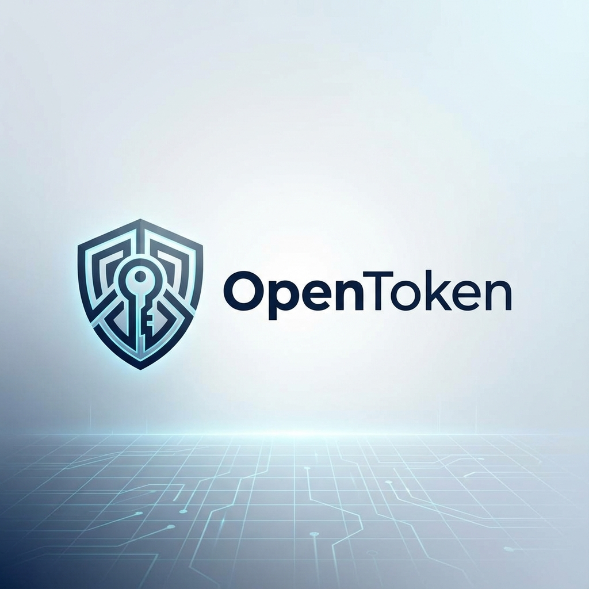

<div align="center">
  

  # OpenToken
  ### *Universal Security & Interoperability Firmware for RP2350*

   [](LICENSE)
   [](#-funcionalidades)
   [](https://github.com/zequinha-taveira/OpenToken)
   [](#-privacidade-soberana)
   [](#-opentoken-nativo)

  ---
</div>

OpenToken é um firmware de segurança de alto desempenho desenvolvido especificamente para o microcontrolador **Raspberry Pi RP2350 (Pico 2)**. Ele transforma hardware acessível em um módulo de segurança robusto, unificando os principais padrões de autenticação e criptografia do mercado em um único dispositivo.

## 🛡️ Camadas de Segurança

O OpenToken foi projetado com uma filosofia de *Security by Design*, dividindo o hardware em domínios lógicos:

*   **Hardware Unique ID Binding**: O sistema deriva sua chave mestra (AES-GCM 256-bit) do identificador único do silício do RP2350. Isso garante que os dados sejam ilegíveis se movidos para outro chip.
*   **Secure Storage**: Armazenamento em Flash isolado e criptografado para segredos e credenciais.
*   **HSM Layer**: Uma camada de abstração criptográfica que interage diretamente com o hardware para operações de chave privada.
*   **TrustZone Separation**: Separação física de recursos (Flash, RAM, Periféricos) entre Mundo Seguro e Mundo Não-Seguro.
*   **Sovereign Supply Chain**: Assinatura offline de firmware garantindo que apenas código autorizado seja executado.

## 🔒 Privacidade Soberana (100% Offline)

O ecossistema OpenToken é construído para operar em isolamento total:

*   **Zero Network Calls**: O aplicativo autenticador não possui permissões de internet e não realiza chamadas para APIs externas ou telemetria.
*   **Local Assets**: Todos os recursos (incluindo fontes e ícones) são embarcados localmente para garantir funcionamento em ambientes *air-gapped*.
*   **No Cloud Dependency**: Seus segredos nunca saem do hardware. Não há sincronização em nuvem, garantindo soberania total sobre sua identidade digital.

## 🚀 Funcionalidades Principais

| Funcionalidade | Descrição | Protocolo |
| :--- | :--- | :--- |
| **FIDO2 / U2F** | Autenticação moderna sem senha e 2FA para web. | CTAP2 / HID |
| **OATH TOTP/HOTP** | Gerador de códigos 2FA nativo e soberano. | CCID / ISO7816 |
| **OpenPGP** | Suporte para chaves PGP (Assinatura, Criptografia, Auth). | CCID / ISO7816 |
| **HSM Abstraction** | Camada unificada para operações RSA/ECC seguras. | mbedTLS 3.x |
| **Custom CCID** | Driver USB CCID de alto desempenho otimizado para o RP2350. | USB Device |

### 4. Status Indicator (WS2812 LED)
Integrated a WS2812 RGB LED driver (GP22) to provide visual feedback for common operations:

| Color | State | Trigger |
| :--- | :--- | :--- |
| 🟢 **Green** | **Idle** | Device initialized and connected |
| 🔵 **Blue** | **FIDO2** | User Presence (Touch) Request |
| 🟡 **Yellow**| **OATH** | TOTP/HOTP Calculation Activity |
| 🔴 **Red** | **Error** | Critical Fault / Safe Mode |
| 🟣 **White** | **Boot** | Power On / Initialization |

## 🔌 Compatibilidade

OpenToken comunica-se através de protocolos padrão para garantir a máxima compatibilidade sem drivers proprietários. O projeto segue padrões abertos da indústria (FIDO2, CCID/ISO7816), o que garante compatibilidade com a maioria dos softwares:

*   **OpenToken NATIVO App**: Experiência oficial e otimizada para Desktop e Mobile.
*   **FIDO2 WebAuthn**: Compatível com navegadores modernos (Chrome, Edge, Firefox) e contas Microsoft/Google.
*   **Standard OATH Tools**: Funciona com qualquer ferramenta baseada em padrões abertos.
*   **GPG / Kleopatra**: Suporte via interface CCID OpenPGP.

> **Nota**: Projeto 100% NATIVO. Não utilizamos identificadores proprietários ou emulação de marcas de terceiros. A soberania é obtida através de protocolos abertos.

## 🛠️ Começando

### Pré-requisitos
- [ARM GNU Toolchain](https://developer.arm.com/Tools%20and%20Software/GNU%20Toolchain)
- [CMake](https://cmake.org/download/) (v3.13+)
- [Raspberry Pi Pico SDK](https://github.com/raspberrypi/pico-sdk)

### Build
```bash
# 1. Clone o repositório
git clone https://github.com/zequinha-taveira/OpenToken.git
cd OpenToken

# 2. Configuração do SDK (Manual - Recomendado para Windows)
# Clone o SDK e inicialize os submódulos vitais (TinyUSB, mbedTLS)
git clone -b master https://github.com/raspberrypi/pico-sdk.git sdk
cd sdk
git submodule update --init lib/tinyusb lib/mbedtls
cd ..

# 3. Compile o firmware
# Nota: Ajuste os caminhos do GCC conforme sua instalação (ex: Chocolatey)
cmake -B build -G "MinGW Makefiles" -DPICO_SDK_PATH="./sdk" \
  -DCMAKE_C_COMPILER="arm-none-eabi-gcc" \
  -DCMAKE_CXX_COMPILER="arm-none-eabi-g++" \
  -DCMAKE_ASM_COMPILER="arm-none-eabi-gcc"

cmake --build build
```

## 🗺️ Roadmap de Desenvolvimento

- [x] Implementação do Driver USB CCID Customizado
- [x] Integração com mbedTLS 3.x para RP2350
- [x] Engine básica para FIDO2/CTAP2
- [x] Implementação completa de Residente Keys (RK) no FIDO2
- [x] Criptografia de chaves via Hardware Unique ID (RP2350)
- [x] Hardening de Privacidade (100% Offline & No-API)
- [x] Interface de gerenciamento via WebUSB

## 🤝 Contribuição

Contribuições são fundamentais para tornar o OpenToken o padrão de segurança open-source para o RP2350. Sinta-se à vontade para abrir issues ou enviar Pull Requests.

1. Faça um Fork do projeto
2. Crie uma Branch para sua feature (`git checkout -b feature/AmazingFeature`)
3. Commit suas mudanças (`git commit -m 'Add some AmazingFeature'`)
4. Push para a Branch (`git push origin feature/AmazingFeature`)
5. Abra um Pull Request

## 📄 Licença

Distribuído sob a licença MIT. Veja `LICENSE` para mais informações.

---
<div align="center">
  Desenvolvido com ❤️ pela comunidade OpenToken.
</div>
