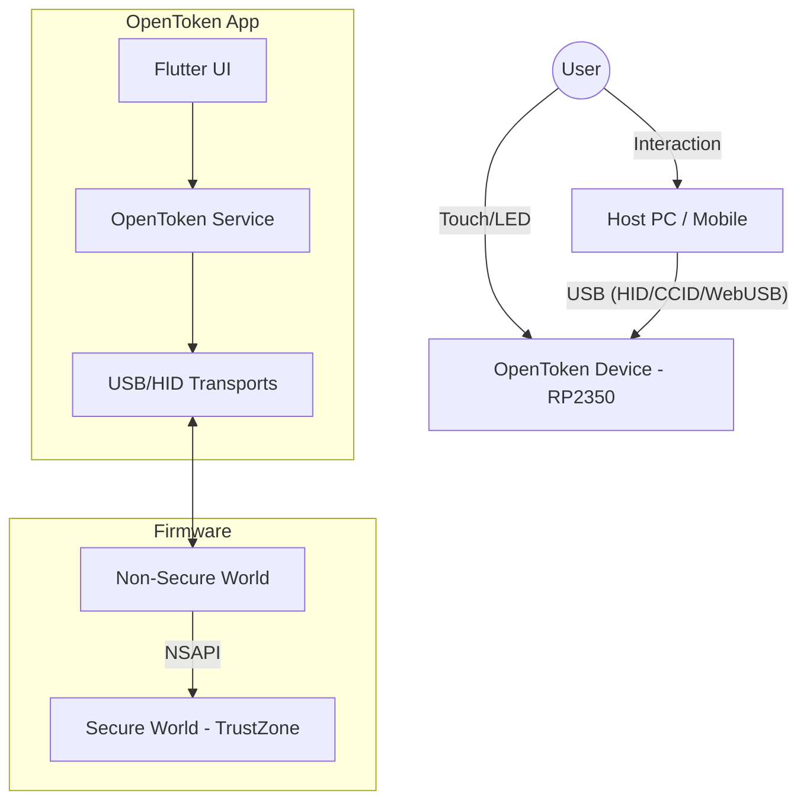
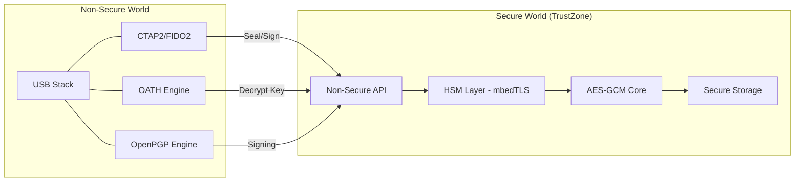
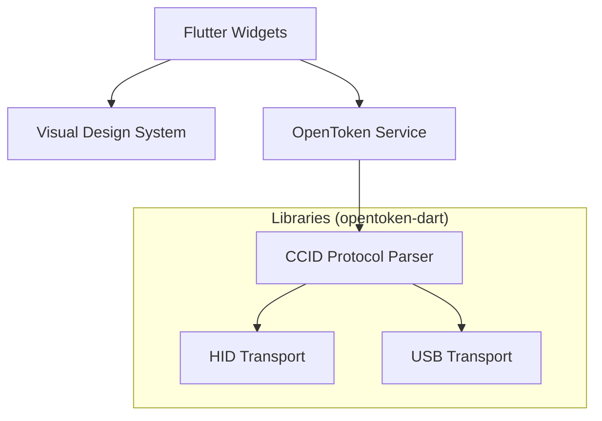

# OpenToken Architecture Map

This document provides a detailed overview of the OpenToken ecosystem architecture, covering the hardware-native firmware for the RP2350 and the companion Flutter application.

## 🌍 Ecosystem Overview

The OpenToken ecosystem is designed for 100% offline operation, ensuring sovereign privacy by eliminating external API dependencies.

---

## 🛡️ Firmware Architecture (RP2350)

OpenToken leverages the RP2350's TrustZone for physical isolation between generic logic and cryptographic secrets.

### Secure World (HSM & Storage)
- **HSM Layer**: Abstracted cryptographic core (ECC, RSA, AES) using mbedTLS.
- **Secure Storage**: Encrypted flash storage for credentials, bound to Hardware Unique ID (UID).
- **Entropy Engine**: ROSC-based Random Number Generation.

### Non-Secure World (Protocols & Interface)
- **USB Stack**: Custom CCID/HID/WebUSB implementation.
- **CTAP2 Engine**: FIDO2/WebAuthn protocol logic.
- **OATH Applet**: TOTP/HOTP calculation engine.
- **OpenPGP Applet**: Smart card emulation for PGP keys.

---

## 📱 OpenToken App Architecture

The app is built with Flutter and utilizes a modular Dart library for cross-platform hardware communication.

### Component Breakdown
1.  **Flutter UI**: Reactive interface for managing credentials and device status.
2.  **OpenToken Service**: High-level business logic for OATH and device management.
3.  **Transports (Lib)**:
    - `windows_hid_driver`: Native Windows HID interface.
    - `transport_usb`: Generic USB transport layer.

---

## 🔌 Communication Stack

OpenToken communicates via standard protocols to ensure maximum compatibility without proprietary drivers.

| Layer | Protocol / Driver | Purpose |
| :--- | :--- | :--- |
| **Physical** | USB 2.0 Full Speed | Data transfer |
| **Transport** | HID (Human Interface Device) | FIDO2 / WebAuthn communication |
| **Transport** | CCID (Chip Card Interface Device) | OATH / OpenPGP / Smart Card |
| **Application**| CTAP2.1 | Passwordless Authentication |
| **Application**| OATH-TOTP/HOTP | 2FA Code Generation |
| **Application**| ISO/IEC 7816 | OpenPGP Smart Card Commands |
